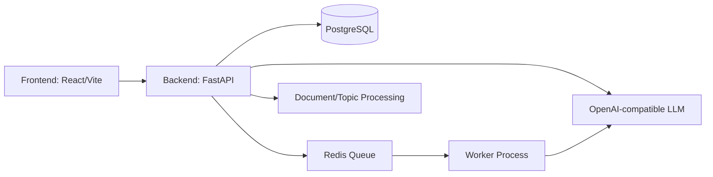

# AI Learning Agent Platform

A production-minded **multi-agent adaptive learning platform** designed for thesis defense and academic demonstration.

This project combines:
- **FastAPI backend** for LMS APIs, assessment orchestration, and reporting.
- **React + Vite frontend** for teacher/student workflows.
- **AI pipeline** for topic extraction, quiz generation, grading, feedback, and learning-path adaptation.
- **PostgreSQL + Redis + worker** for reliable async processing.

---

## 1) System Overview

The platform supports a full adaptive-learning loop:

1. Teacher uploads learning materials.
2. System extracts/cleans topics and builds a topic map.
3. AI services generate quizzes/assessments with configurable strictness.
4. Student submissions are graded (LLM + heuristic fallback).
5. Analytics and weaknesses feed back into personalized learning plans.

Core design goals:
- **Pedagogical alignment** (topic-grounded generation).
- **Operational reliability** (healthchecks, queue worker, Dockerized stack).
- **Safe fallbacks** (offline/heuristic behavior when LLM is unavailable).

---

## 2) Clean Folder Structure

```text
AI-AGENTS/
├── app/                      # Agent orchestration core, domain abstractions, shared guardrails
├── backend/                  # FastAPI service, DB models, Alembic migrations, tests
│   ├── app/
│   ├── alembic/
│   ├── tests/
│   ├── Dockerfile
│   ├── requirements.txt
│   └── .env.example
├── frontend/                 # React + Vite UI
│   ├── src/
│   ├── Dockerfile
│   └── .env.example
├── docs/                     # Architecture, design docs, reports, demo support artifacts
├── tools/                    # Utility scripts (e.g., BOM stripping)
├── tests/                    # Root-level unit tests for agent-core modules
├── docker-compose.yml        # Full local stack (db, redis, backend, worker, frontend)
├── Dockerfile                # Root convenience Dockerfile (backend service image)
├── requirements.txt          # Root Python dependency entrypoint for quick setup
└── .env.example              # Canonical environment template for onboarding
```

---

## 3) Architecture Explanation

### 3.1 Logical Architecture



### 3.2 Module Responsibility

- `backend/app/api`: HTTP routers and request/response contracts.
- `backend/app/services`: business logic (quiz, exams, topics, reports, learning path).
- `backend/app/models`: SQLAlchemy entities.
- `backend/alembic`: schema evolution and migration history.
- `app/application` + `app/agents`: multi-agent orchestration prototypes and reusable orchestration patterns.

---

## 4) Database Schema (High-Level)

The schema evolves through Alembic migrations and centers around the LMS/adaptive assessment domain:

- **Users/Auth domain**: users, roles, session/auth support.
- **Classroom domain**: classrooms, enrollments, teacher/student relation.
- **Content domain**: documents, extracted topics, topic metadata/cache.
- **Assessment domain**: quizzes/exams, question bank, attempts, submissions, explanations.
- **Learning analytics domain**: results, weak-topic diagnostics, recommendation artifacts.

Migration source of truth:
- `backend/alembic/versions/*`
- `backend/alembic/env.py`

For defense presentation, a practical way to show schema:
```bash
cd backend
alembic upgrade head
# then use your preferred DB inspection tool (DBeaver/pgAdmin) to export ERD
```

---

## 5) AI Pipeline

### 5.1 End-to-End Pipeline

1. **Ingestion**
   - Upload source docs (PDF/text).
   - Extract raw text using multi-strategy fallback.

2. **Quality Control**
   - OCR quality scoring.
   - Low-quality section filtering and guardrails.

3. **Topic Structuring**
   - Heading/lesson-aware split.
   - Merge short fragments to satisfy minimum context.

4. **Generation Layer**
   - Quiz/exam generation from grounded topic context.
   - Optional LLM refine pass for wording/rubrics.

5. **Evaluation Layer**
   - Auto-grading (LLM when available, heuristic fallback otherwise).
   - Explanation enrichment for learning feedback.

6. **Personalization Layer**
   - Weak-topic identification.
   - Teacher-style 7-day learning plan generation.

### 5.2 Reliability Design

- **Mode switching**: `auto | llm | offline` for key generators.
- **Queue-based async jobs** via Redis worker.
- **Config-driven behavior** via `.env` for reproducibility.

---

## 6) Setup Instructions

### 6.1 Prerequisites

- Docker Engine + Docker Compose plugin
- Git
- Free ports: `5432`, `6379`, `8000`, `5173`

### 6.2 One-Command Local Stack (Recommended)

```bash
git clone <your-repo-url>
cd AI-AGENTS
cp .env.example backend/.env
docker compose up --build -d
docker compose ps
```

Services:
- Frontend: `http://localhost:5173`
- Backend docs: `http://localhost:8000/docs`
- Health: `http://localhost:8000/health`

### 6.3 Database Migration

```bash
docker compose exec backend alembic upgrade head
```

### 6.4 Optional Local (without Docker)

Backend:
```bash
cd backend
cp .env.example .env
python -m venv .venv
source .venv/bin/activate
pip install -r requirements.txt
alembic upgrade head
uvicorn app.main:app --reload --host 0.0.0.0 --port 8000
```

Frontend:
```bash
cd frontend
cp .env.example .env
npm install
npm run dev
```

---


## DEMO MVP API (New)

Core endpoints under `/api/mvp`:

- `POST /api/auth/register`
- `POST /api/login`
- `POST /api/mvp/courses/upload` (teacher)
- `POST /api/mvp/courses/{course_id}/generate-topics` (teacher)
- `POST /api/mvp/courses/{course_id}/generate-entry-test` (teacher)
- `GET /api/mvp/student/course` (student)
- `GET /api/mvp/student/exams/latest` (student)
- `POST /api/mvp/student/exams/{exam_id}/submit` (student)
- `GET /api/mvp/teacher/results?page=1&page_size=10` (teacher, paginated)
- `POST /api/mvp/student/tutor`

Sample response (topics):

```json
{
  "data": {
    "topics": [
      {"title": "Topic 1", "summary": "...", "exercises": ["Exercise 1.1", "Exercise 1.2", "Exercise 1.3"]}
    ]
  }
}
```

Simple local run:

```bash
cd backend && cp .env.example .env && pip install -r requirements.txt && uvicorn app.main:app --reload
cd frontend && npm install && npm run dev
```

## 7) Demo Instructions (for Thesis Defense)

### 7.1 Suggested Demo Storyline

1. Login as teacher/admin.
2. Create classroom and upload a learning document.
3. Generate topics and inspect topic quality.
4. Create quiz/exam from selected topics.
5. Submit a student attempt.
6. Show grading/explanations and weak-topic analytics.
7. Generate personalized learning plan.

### 7.2 Demo Stability Checklist

```bash
docker compose ps
docker compose logs --tail=100 backend
docker compose logs --tail=100 worker
curl -fsS http://localhost:8000/health
```

### 7.3 Backup Plan (No External LLM)

Set these in `backend/.env`:
```env
QUIZ_GEN_MODE=offline
LESSON_GEN_MODE=offline
ESSAY_AUTO_GRADE=always
```

This allows deterministic fallback behavior for a live demo even if LLM connectivity is unstable.

---

## 8) Environment Configuration

- Canonical template: `/.env.example`
- Runtime file used by Compose: `/backend/.env`
- Backend-local template: `/backend/.env.example`

Quick start:
```bash
cp .env.example backend/.env
```

---

## 9) Submission-Ready Assets Included

- ✅ Clean, explainable folder structure.
- ✅ Root `requirements.txt` for fast Python bootstrap.
- ✅ Root `Dockerfile` + service Dockerfiles.
- ✅ `docker-compose.yml` for full-stack orchestration.
- ✅ Canonical `.env.example` for onboarding.
- ✅ Defense-grade README (overview, architecture, DB schema, AI pipeline, setup, demo).

- Tài liệu thiết kế: `docs/enterprise_multi_agent_architecture.md`
- Điểm vào demo: `python -m app.interfaces.cli.main`
- Test deterministic cho orchestration/guardrails: `pytest tests/unit -q`

## AI Teacher Platform (Clean Architecture v2)

Đã bổ sung kiến trúc production-ready cho luồng AI Teacher tại `backend/app/learning_engine` gồm 4 layer:
- `presentation`
- `application`
- `domain`
- `infrastructure`

### Example endpoints
- `POST /api/v2/teacher-ai/documents/ingest`
- `POST /api/v2/teacher-ai/assessments/entrance`
- `POST /api/v2/teacher-ai/students/evaluate`
- `POST /api/v2/teacher-ai/exercises/generate`
- `POST /api/v2/teacher-ai/progress/update`
- `POST /api/v2/teacher-ai/reports/final`

### Artifacts
- Architecture blueprint: `docs/ai_teacher_platform_refactor.md`
- SQL schema: `docs/sql/learning_engine_schema.sql`
- Internal prompts: `docs/ai_teacher_prompts.md`
- Deployment guide: `docs/deployment_guide_ai_teacher.md`

### Improvement suggestions
1. Replace in-memory repositories bằng PostgreSQL adapter (SQLAlchemy AsyncSession).
2. Cắm Chroma adapter thực tế cho `VectorIndexPort`.
3. Tách orchestrator jobs sang Celery/RQ workflow với retry + dead-letter queues.
4. Thêm integration tests cho full student journey (upload -> report).
5. Thêm CI stage benchmark latency cho multi-agent pipeline.

## Node.js LMS Scaffold (experimental)

Repository now includes a TypeScript Node/React scaffold for an AI-powered LMS:
- `backend/src/server.ts`: Express APIs for auth/teacher/student.
- `backend/src/prisma/schema.prisma`: LMS Prisma schema.
- `backend/src/services/ai-agent.service.ts`: Claude integration class with retry/backoff.
- `frontend/src`: React auth flow and role-based dashboards.

This scaffold is additive and can be run independently from the original FastAPI stack.
